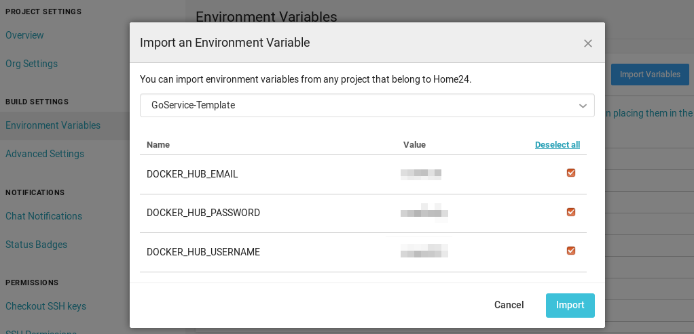

# GoService-Template

This is a template repository for quickly starting a service written in Golang. It has
most of the stuff needed for fully-functional service written according to home24 best practices and know-how.

More details about templating idea can be found in RFC https://home24.atlassian.net/wiki/spaces/TT/pages/197427251/Application+Template

Owner|Type
---|---
Platform & Dev Experience|Support

##### Tech

- Golang
- Docker
- Artisan
- CircleCI
- ECS
- NewRelic

##### Contexts

- MaintenanceOnly

## What you will get (what's inside)

* Golang application with simple webserver endpoint
    * Dependency management
    * Application layout
    * Examples of unit tests
    * Logging approach
* Documentation skeleton
* Docker integration
    * Docker build, container
    * DCS integration
* CI integration
    * CircleCI build that runs all tests, lints
* Deployment integration
    * Integration with AWS ECS Deployment (Infrastructure-Templates, ECS), running Docker containers
    * Logging integration (logs are pushed to CloudWatch and rotated)
    * Metrics integration (default metrics have alarms, sane defaults, OpsGenie integration)
    * CD integration: automatic deploy to staging on push to master, live - on tag

### What is missing (TODO)

* Application secrets management
* Examples with databases (like DynamoDB)

## Assumptions

* You have at least following knowledge:
    * [ ] basic [Docker](https://www.docker.com/)
    * [ ] basic [AWS](https://aws.amazon.com/)
    * [ ] basic [Golang](https://golang.org/)
    * [ ] basic [CircleCI](https://circleci.com/), [GitHub](https://github.com/Home24/), [git](https://git-scm.com/)
    * [ ] basic command line usage
* You have access to
    * [ ] to [GitHub](https://github.com/Home24/) (home24 org)
    * [ ] to [Dockerhub](https://hub.docker.com/) (pulling and pushing docker images)
    * [ ] to [CircleCI](https://circleci.com/) (GitHub can be used to get access there)
    * [ ] to AWS account (including sufficient rights) you are going to deploy to (you're able to login using sso to the account)
* You are using MacOS or Linux based machine which has:
    * [ ] Docker installed
    * [ ] Golang, make installed
* You have following tools installed:
    * [ ] [aws cli](https://aws.amazon.com/cli/) (for calling AWS APIs using command line)
    * [ ] [sso](https://github.com/Home24/Go-Tools/tree/master/cmd/sso) (used for getting AWS APIs credentials through single sign-on)
    * [ ] [artisan](https://github.com/Home24/Infrastructure-Artisan) (used for deploying)
* You chose AWS account to deploy staging to
    * [ ] Account must have Shared VPC (under VPC->Your VPCs you should see VPC vpc-078a7803aa0b3375d, named Shared). If no - chose another account or ask Helpdesk to assign Shared VPC to your account. Usually all team accounts have Shared VPC already.
    * [ ] Your account has public Route53 hosted zone (DNS records will be created there)

## Directory layout

This repository follows [Standard Go Project Layout](https://github.com/golang-standards/project-layout).

Additionally there are following directories:
* `infrastructure/` - all infrastructure related templates, parameters, etc. (used by `artisan`)
* `scripts/` - helper scripts

## How setup from this template

### Minimal version

1. Create new GitHub repository repository from template:

[](https://github.com/Home24/GoService-Template/generate)

2. Clone new repository

3. Rebrands names from _template_ to your new repository name

```bash
scripts/rebrand-template.sh
```

### Staging environment

:information_source: Make sure you are using latest `artisan` version

> Assuming `sso` was used to login to your `staging` aws account

4. Configure and deploy _staging_ environment.
```bash
artisan setup-for-shared-vpc
```

### Production environment (optional)

> Assuming `sso` was used to login to your `production` aws account

5. Configure and deploy _production_ environment with:
```
artisan setup-for-shared-vpc --environment=production
```

### CircleCI configuration

6. Configure initial DockerHub credentials in CircleCI:

Click `Import variables` from
[CircleCI project settings](https://circleci.com/gh/Home24/GoService-Template/edit#env-vars)

And choose `GoService–Template`

[](https://circleci.com/gh/Home24/GoService-Template/edit#env-vars)

7. Enable Docker Hub password rotation:

As documented in [Infrastructure-PasswordRotate: `Request CircleCI credentials for project`](https://github.com/Home24/Infrastructure-PasswordRotate#step-2-request-circleci-credentials-for-project)

### New Relic configuration

8. Set New Relic license key secret for deployed environments:

Create new **license** key as described [here](https://docs.newrelic.com/docs/apis/get-started/intro-apis/new-relic-api-keys/#license-key-create)
and set it as environment variable:

```bash
export NEW_RELIC_LICENSE_KEY=value-you-copied
```

```bash
export NEW_RELIC_LICENSE_SECRET_RESOURCE=$(aws --output text cloudformation describe-stack-resources \
  --stack-name goservice-template-service-staging \
  --logical-resource-id NewRelicLicenseSecret \
  --query 'StackResources[0].PhysicalResourceId')
```

```bash
aws secretsmanager put-secret-value --secret-id=${NEW_RELIC_LICENSE_SECRET_RESOURCE} --secret-string ${NEW_RELIC_LICENSE_KEY}
```

9. Set New Relic related env variables in CircleCI:

Create new [**user** key (aka API key)](https://docs.newrelic.com/docs/apis/get-started/intro-apis/new-relic-api-keys/#user-key-create).
Copy its value and set it as `NEW_RELIC_API_KEY` environment variable
value in CircleCI and on your machine. We will need it later.

In order to have application name reserved in New Relic,
run the command below. It runs example application and
sends a request to it. As a result, an application page will
be created in New Relic. We need that to get New Relic application
ID for later use.

```bash
export NEW_RELIC_APP_NAME=GoService-Template-Staging
```

```bash
make && docker run \
  --env NEW_RELIC_LICENSE_KEY \
  --env NEW_RELIC_APP_NAME \
  -d --rm --name nr-temp \
  home24/goservice-template:latest && \
  sleep 5 && \
  docker exec nr-temp sh \
  -c "wget -O - localhost/test" && \
  docker stop nr-temp
```

Query New Relic by using New Relic CLI to get New Relic
application id. After running the command below, copy
value of `applicationId` and set it as `NEW_RELIC_APP_ID_STAGING`
environment variable in CircleCI.

```bash
docker run -it --rm \
  --env NEW_RELIC_API_KEY \
  --env NEW_RELIC_REGION=eu \
  newrelic/cli entity search \
  --name ${NEW_RELIC_APP_NAME}
```

Repeat the same process for production environment.
The only difference is New Relic App name. Set name for
production app. Do request to the app, query New Relic for
app ID and set it to CircleCI as `NEW_RELIC_APP_ID_PRODUCTION`

```bash
export NEW_RELIC_APP_NAME=GoService-Template-Production
```

10. Service in AWS ECS will take updated _NewRelicLicenseSecret_ value only on startup.

So service needs to be reloaded via manual _Update_ service with _Force new deployment_,
or via redeploying via merge to CircleCI.

# Service Registry Record

This application is:
- An example Go application, which can be used as a base for new projects.

## Passport

|||
--- | ---
Status | ???
Tier | ???
Responsible Team | ???
GChat channel | ???
Email | ???

## Links

|Key|Value|
:---|---
GoService-Template | https://github.com/Home24/GoService-Template

## Architecture

TODO
<!--  -->

## Used technologies

- Golang
- AWS (ECS Deployment)

## Sources

Link | Description
:--- | ---
https://github.com/Home24/GoService-Template | Main repository
`???` | Staging AWS Account
`???` | Production AWS Account
## Dependencies

Link | Comment
--- | ---


## How develop this project

### Running locally

```bash
HTTP_PORT=8080 go run cmd/example/main.go
```

### Building and running docker image

Compile and build docker image:
```bash
make
```

To rebuild:
```bash
make clean
make build
```

## How to deploy

See [deployment documentation](docs/deploy.md)
